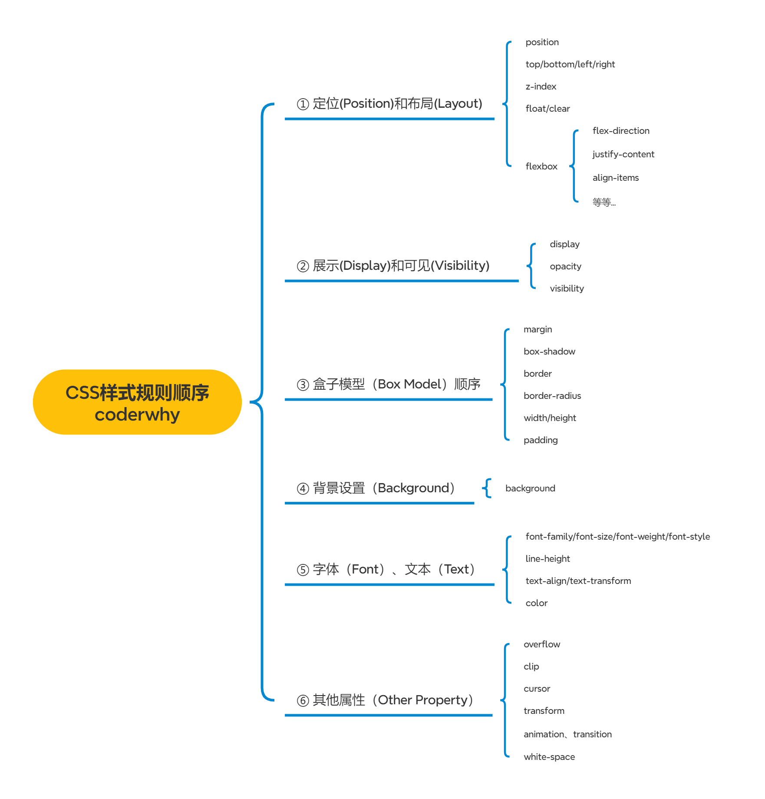
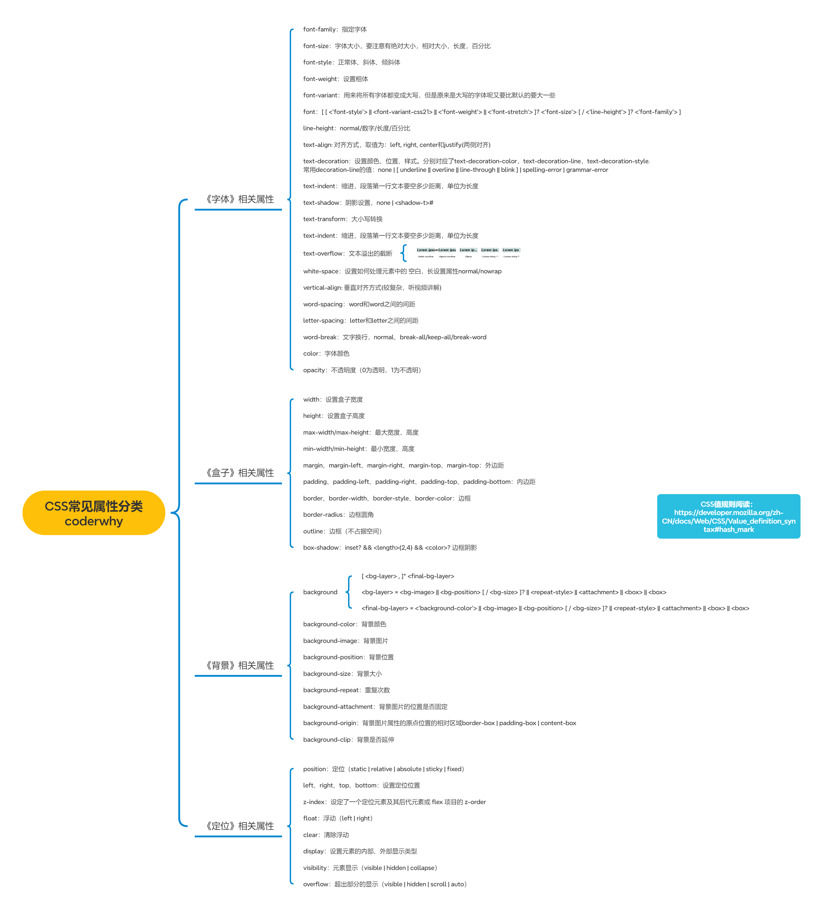

# 邂逅 CSS

## 1. 认识 CSS

- CSS 表示层叠样式表（CascadingStyle Sheet，简称：CSS，又称为又称串样式列表、级联样式表、串接样式表、阶层式样式表）是为网页添加样式的代码
- CSS 是一种语言吗？
  - MDN 解释：CSS 也不是真正的编程语言，甚至不是标记语言。它是一门样式表语言
  - 维基百科解释：是一种计算机语言，但是不算是一种编程语言
- CSS3？
  - 其实没有一个大版本叫 CSS3，从 CSS3 开始，所有的 CSS 分成了不同的模块（modules），每一个“modules”都有于 CSS2 中额外增加的功能，以及向后兼容
  - 直到 2011 年 6 月 7 日，CSS 3 Color Module 终于发布为 W3C Recommendation

## 2. CSS 的编写与应用

- 声明（Declaration）一个单独的 CSS 规则，如 color: red; 用来指定添加的 CSS 样式
  - 属性名（Property name）：要添加的 css 规则的名称
  - 属性值（Property value）：要添加的 css 规则的值
- 应用
  - 内联样式（inline style）
    - 内联样式表存在于 HTML 元素的 style 属性之中。
    - CSS 样式之间用分号;隔开，建议每条 CSS 样式后面都加上分号
    - 在 Vue 的 template 中某些动态的样式是会使用内联样式的
  - 内部样式表（internal style sheet）、文档样式表（document style sheet）、内嵌样式表（embed style sheet）
    - 将 CSS 放在 HTML 文件`<head>`元素里的`<style>`元素之中
    - 在 Vue 的开发过程中，每个组件也会有一个 style 元素，和内部样式表非常的相似（原理并不相同）
  - 外部样式表（external style sheet）
    - 将 css 编写一个独立的文件中，并且通过`<link>`元素引入进来

> 可以在 style 元素或者 CSS 文件中使用@import 导入其他的 CSS 文件，来集中引用 CSS 资源

```CSS
@import url(./style.css);
@import url(./test.css);
```

## 3. CSS 的注释

- CSS 的注释和 HTML 的注释是不一样的
- 不用担心注释会增大文件体积，打包工具（Webpack）会自动优化掉这些注释

```CSS
/* 注释内容 */
```

## 4. 常见的 CSS 元素

- 相关资料

  - [CSS 官方文档地址](https://www.w3.org/TR/?tag=css)
  - [MDN CSS 文档](https://developer.mozilla.org/zh-CN/docs/Web/CSS/Reference#%E5%85%B3%E9%94%AE%E5%AD%97%E7%B4%A2%E5%BC%95)
  - [查询 CSS 可用性](https://caniuse.com/)

  
  

## 5. CSS 常见的五个属性

- font-size：文字大小
- color：前景色，包括文字、装饰线、边框、外轮廓等的颜色
- background-color：背景色
- width：宽度 div 哪怕更改宽度，还是可以独占一行，除非配合 flex
- height：高度
