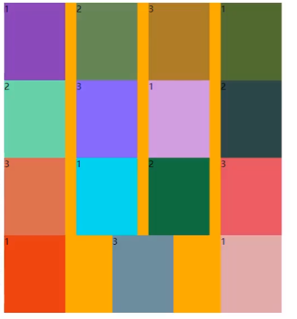

# flex 布局

## 认识 flexbox

### flexbox（弹性盒子）

- 一种用于按行或按列布局元素的一维布局方法
- 可以膨胀填充额外空间，可以收缩适应空间
- 用 Flexbox 布局的方案叫作 flex 布局(flex layout)

### flex 布局的优势

- 目前在移动端已经特别普及
- 在 PC 端也特别普及，只有少数网站使用浮动
- grid 的兼容性不如 flex，float 的实用性不如 flex，所以 flex 是综合来看最适应的布局

> "44 years ago we put a man on the moon, but we still can't vetically center things in CSS"

## flex 布局的重要概念

### 两个重要的概念

- 开启 flex 布局的元素叫 flex container
- flex container 里面的直接子元素叫 flex item

### flex item 的特点

- flex item 的布局受 flex container 属性的设置来进行控制和布局
- flex item 不再严格区分块级元素和行内级元素
- flex item 默认情况下是包裹内容的，但可以设置宽度高度

### 设置 display 属性

- flex：flex container 以 block-level 形式存在
- inline-flex：flex container 以 inline-level 形式存在

### flex 布局的模型

- main axis 主轴
- cross axis 交叉轴

## flex 属性

### 作用在 flex container 上的属性

#### flex-direction

- flex items 默认都是沿着 main axis 从 main start 开始往 main end 方向排布
  - flex-direction 决定了 main axis 的方向，有四个取值
  - row（默认值），row-reverse，column，column-reverse

#### flex-wrap

- flex-wrap 决定了 flex-container 是一行还是多行
  - nowarp（默认）：单行
  - wrap：多行
  - wrap-reverse：多行（比如本来是从上到下，现在是从下到上）

#### flex-flow

- flex-flow 是 flex-direction 和 flex-wrap 的简写
  - 顺序任意，并且可以省略

#### align-items

- align-items 决定了 flex items 在 cross axis 的排列方式
  - normal： 在 flex 布局中，效果和 stretch 一样
  - stretch：当 flex items 在 cross axis 的方向为 auto 适，会自动拉伸至填充 flex container
  - flex-start：与 crossstart 对齐
  - flex-end：与 cross end 对齐
  - center：居中对齐
  - baseline：与基准线对齐

#### align-content

- align-content 决定了多行 flex items 在 cross axis 上的对齐方式，用法和 justify-content 相似
  - stretch：当 flex items 在 cross axis 的方向为 auto 适，会自动拉伸至填充 flex container
  - flex-start：与 crossstart 对齐
  - flex-end：与 cross end 对齐
  - center：居中对齐
  - space-between：
    - flex items 之间距离相等
    - 与 main start/end 对齐
  - space-around：
    - flex items 之间距离相等
    - flex-items 与 main start，main end 之间的距离是 flex items 之间距离的一半
  - space-evenly：
    - flex items 之间距离相等
    - flex items 与 main start，main end 之间的距离等于 flex items 之间的距离

#### justify-content

- justify-content 决定了 flex-items 在 main axis 上的对齐方式
  - flex-start（默认值）：与 main start 对齐
  - flex-end：与 main end 对齐
  - center：居中对齐
  - space-between：
    - flex items 之间距离相等
    - 与 main start/end 对齐
  - space-around：
    - flex items 之间距离相等
    - flex-items 与 main start，main end 之间的距离是 flex items 之间距离的一半
  - space-evenly：
    - flex items 之间距离相等
    - flex items 与 main start，main end 之间的距离等于 flex items 之间的距离

### 作用在 flex items 上的属性

#### order

- order 决定了 flex items 的排布顺序
  - 可以是任意整数，值小的排前面
  - 默认值是 0

#### align-self

- 在交叉轴进行配置单个 flex item 的样式
  - auto（默认值）：直接继承 flex container 的 align-items 设置
  - 单独设置，效果一样

#### flex-grow

- flex-grow 决定了 flex items 如何拓展（分配剩余空间）

  - 可以设置任意非负数字，默认值为 0
  - 当 flex-container 在 main axis 方向上有剩余 size 时，flex-grow 才会生效

- 如果所有 flex items 的 flex-grow 总和 超过 1，每个 flex item 拓展的 size 为
  - flex container 的剩余 size \* flex-grow / sum
  - flex items 拓展后的最终 size 不能超过 max-width/max-height

#### flex-shrink

- flex-shrink 决定了 flex items 如何收缩
  - 可以设置任意非负数字，默认值为 1
  - 当 flex items 在 main axis 方向上超过了 flex container 的 size，flex-shrink 属性才会有效
- 如果所有 flex items 的 flex-shrink 总和超过 1，每个 flex item 收缩的 size 为
  - flex items 超过 flex container 的 size \* 收缩比例 / 所有 flex items 的收缩比例之和
- flex items 收缩后的最终 size 不可以小于 min-width/min-height

#### flex-basis

- flex-basis 用来设置 flex items 在 main axis
  - auto（默认值），具体的宽度数值（100px）
  - 例子：比如有一个特别长的单词，如果是设置 width，他就无法完整显示，如果设置了 flex-basis 会自动拓展盒子
- 决定 flex items 最终的 base size 的因素，优先级从高到低
  - max-width/max-height/min-width/min-height
  - flex-basis
  - width/height
  - 内容本身的 size

#### flex

使用 flex 属性，性能优化更好一些

- flex 是缩写属性 flex-grow || flex-shrink || flex-basis
  - 单值语法：下面三选一
    - 一个无单位数，则设置 flex-grow
    - 一个有效宽度，则设置 flex-basis
    - keywords
      - none: 0 0 auto
      - auto: 1 1 auto
      - initial: 0 1 auto
  - 双值语法：第一个值必须无单位，且为 flex-grow
    - 第二值下面二选一
      - 一个无单位值，则设置 flex-shrink
      - 一个有效的宽度值，则设置为 flex-basis

#### gap

gap, row-gap, column-gap

#### 解决布局问题

如果前面排列都正常，最后一排却不满足要求，我们如何解决问题呢？

1. 数学计算
2. 使用``来解决  
   相当于用没有 height 的 `` 来进行一个占位，只需要给 `` 设置相同的宽度即可
   添加 `列数 - 2` 的 `` 即可

#### 总结图片

### 资源大全：

- [CSS-Tricks 文字/图片教程](https://css-tricks.com/snippets/css/a-guide-to-flexbox/)
- [codewhy 视频教程](https://www.bilibili.com/video/BV1pK411X7sn?p=1)
