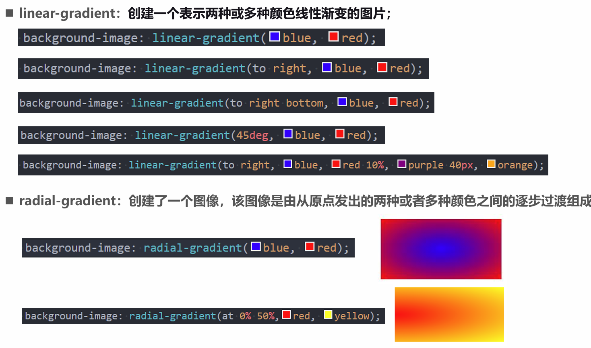
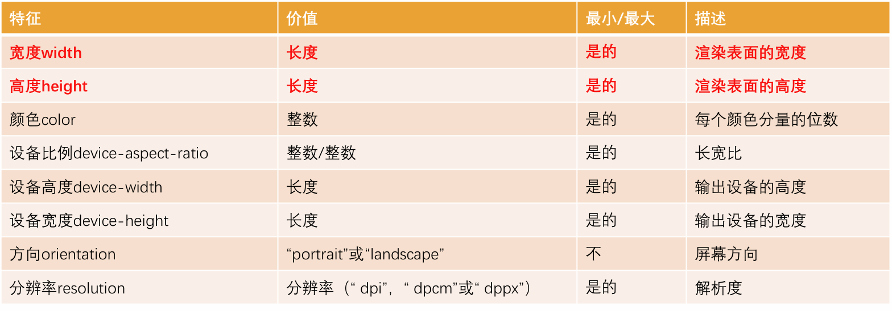
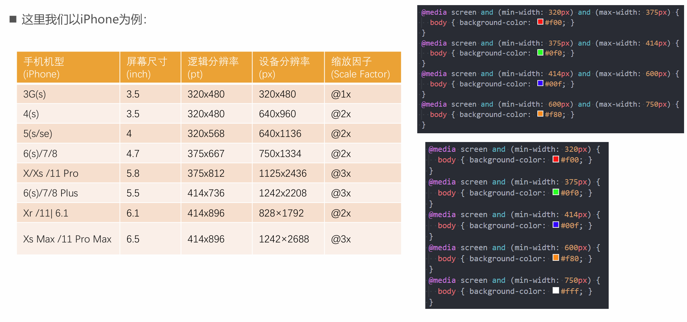
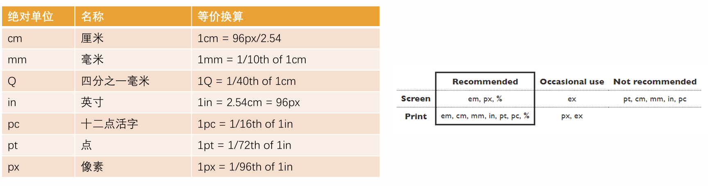
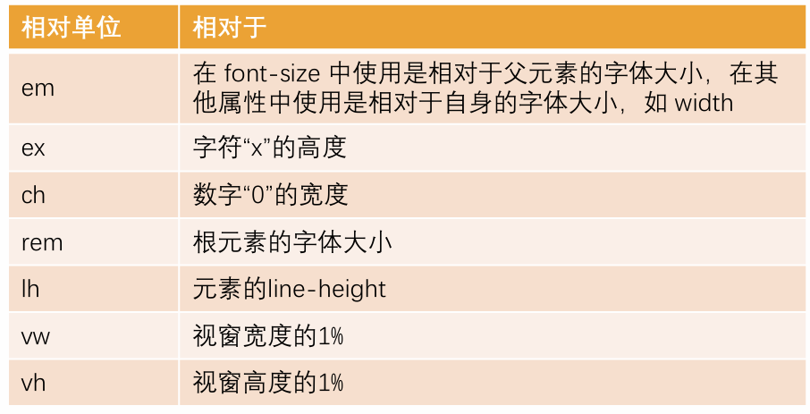

# 额外知识补充

## 1. white-space

- white-space 用于设置空白处理和换行规则
  - normal：合并所有连续的空白，允许单词超屏时自动换行
  - nowrap：合并所有连续的空白，不允许单词超屏时自动换行
  - pre：阻止合并所有连续的空白，不允许单词超屏时自动换行，**也不合并换行符。**
  - pre-wrap：阻止合并所有连续的空白，允许单词超屏时自动换行
  - pre-line：合并所有连续的空白（但保留换行），允许单词超屏时自动换行

## 2. text-overflow

- text-overflow 通常用来设置文字溢出时的行为
  - clip：溢出的内容直接裁剪掉（字符可能会显示不完整）
  - ellipsis：溢出那行的结尾处用省略号表示
- text-overflow 生效的前提是 overflow 不为 visible
- 常见的是将 white-space、text-overflow、overflow 一起使用：

## 3. CSS 中的函数

- 在前面我们有使用过很多个 CSS 函数:
  - 比如 rgb/rgba/translate/rotate/scale 等;
  - CSS 函数通常可以帮助我们更加灵活的来编写样式的值；
    — 下面我们再学习几个非常好用的 CSS 函数:
  - var: 使用 CSS 定义的变量;
  - calc: 计算 CSS 值, 通常用于计算元素的大小或位置;
  - blur: 毛玻璃(高斯模糊)效果;
  - gradient：颜色渐变函数；

### var

- CSS 中可以自定义属性
  - 属性名需要以两个减号（--）开始;
  - 属性值则可以是任何有效的 CSS 值;
- 我们可以通过 var 函数来使用:
  - 规则集定义的选择器, 是自定义属性的可见作用域(只在选择器内部有效)，只有后代才可以使用
  - 所以推荐将自定义属性定义在 html 中，也可以使用:root 选择器，

```HTML
<style>
  :root {
    --main-color: #foo;
  }

  .box {
    color: var(--main-color);
  }
</style>
```

### calc

- calc() 函数允许在声明 CSS 属性值时执行一些计算。
  - 计算支持加减乘除的运算；
    - `+` 和`-`运算符的两边必须要有空白字符。
  - 通常用来设置一些元素的尺寸或者位置；

> width 的百分比相对于包含块（父元素）

### blur

- blur() 函数将高斯模糊应用于输出图片或者元素;
  - blur(radius)
  - radius, 模糊的半径, 用于定义高斯函数的偏差值, 偏差值越大, 图片越模糊;
- 通常会和两个属性一起使用：
  - filter: 将模糊或颜色偏移等图形效果应用于元素;
  - backdrop-filter: 为元素后面的区域添加模糊或者其他效果
    - 需要结合 background-color 一起使用

### gradient

- `<gradient>` 是一种`<image>`CSS 数据类型的子类型，用于表现两种或多种颜色的过渡转变。
  - CSS 的`<image>`数据类型描述的是 2D 图形；
  - 比如 background-image、list-style-image、border-image、content 等；
  - `<image>`常见的方式是通过 url 来引入一个图片资源；
  - 它也可以通过 CSS 的`<gradient>` 函数来设置颜色的渐变；
- `<gradient>`常见的函数实现有下面几种：
  - linear-gradient()：创建一个表示两种或多种颜色线性渐变的图片；
  - radial-gradient()：创建了一个图像，该图像是由从原点发出的两种或者多种颜色之间的逐步过渡组成；
  - repeating-linear-gradient()：创建一个由重复线性渐变组成的`<image>`；
  - repeating-radial-gradient()：创建一个重复的原点触发渐变组成的`<image>`;

#### linear-gradient 的使用



> 实际上生成的是一个图片`<iamge>`

## 4. 浏览器前缀

- 有时候可能会看到有些 CSS 属性名前面带有：-o-、-xv-、-ms-、mso-、-moz-、-webkit
- 官方文档专业术语叫做：vendor-specific extensions（供应商特定扩展）
- 为什么需要浏览器前缀了？
  - CSS 属性刚开始并没有成为标准，浏览器为了防止后续会修改名字给新的属性添加了浏览器前缀；
- 上述前缀叫做浏览器私有前缀，只有对应的浏览器才能解析使用
  - -o-、-xv-：Opera 等
  - -ms-、mso-：IE 等
  - -moz-：Firefox 等
  - -webkit-：Safari、Chrome 等

```CSS
.box {
  -moz-transform: translate(100px);
}
```

> 注意：不需要手动添加，后面学习了模块化打包工具会自动添加浏览器前缀

## 5. FC

- 什么是 FC 呢？
  - FC 的全称是 Formatting Context，元素在标准流里面都是属于一个 FC 的；
- 块级元素的布局属于 Block Formatting Context（BFC）
  - 也就是 block level box 都是在 BFC 中布局的；
- 行内级元素的布局属于 Inline Formatting Context（IFC）
  - 而 inline level box 都是在 IFC 中布局的

## 6. BFC

- block level box 都是在 BFC 中布局的，那么这个 BFC 在哪里呢？拿出来给我看看。
- MDN 上有整理出在哪些具体的情况下会创建 BFC：
  - 根元素（`<html>`）
  - 浮动元素（元素的 float 不是 none）
  - 绝对定位元素（元素的 position 为 absolute 或 fixed）
  - 行内块元素（元素的 display 为 inline-block）
  - 表格单元格（元素的 display 为 table-cell，HTML 表格单元格默认为该值），表格标题（元素的 display 为 table-caption，HTML 表格标题默认为该值）
  - 匿名表格单元格元素（元素的 display 为 table、table-row、 table-row-group、table-header-group、table-footer-group（分别是 HTML table、row、tbody、thead、tfoot 的默认属性）或 inline-table）
  - overflow 计算值(Computed)不为 visible 的块元素
  - 弹性元素（display 为 flex 或 inline-flex 元素的直接子元素）
  - 网格元素（display 为 grid 或 inline-grid 元素的直接子元素）
  - display 值为 flow-root 的元素

### BFC 有什么作用呢？

- 简单概况如下：
  - 在 BFC 中，box 会在垂直方向上一个挨着一个的排布；
  - 垂直方向的间距由 margin 属性决定；
  - 在同一个 BFC 中，相邻两个 box 之间的 margin 会折叠（collapse）；
  - 在 BFC 中，每个元素的左边缘是紧挨着包含块的左边缘的；
- 那么这个东西有什么用呢？
  - 解决 margin 的折叠问题；
  - 解决浮动高度塌陷问题；

### BFC 的作用一：解决折叠问题（权威）

- 在同一个 BFC 中，相邻两个 box 之间的 margin 会折叠（collapse）
  - 官方文档明确的有说
  - The vertical distance between two sibling boxes is determined by the 'margin' properties. Vertical margins between adjacent block-level boxes in a block formatting context collapse.
  - 那么如果我们让两个 box 是不同的 BFC 呢？那么就可以解决折叠问题。

### BFC 的作用二：解决浮动高度塌陷（权威）

- 网上有很多说法，BFC 可以解决浮动高度塌陷，可以实现清除浮动的效果。
  - 但是从来没有给出过 BFC 可以解决高度塌陷的原理或者权威的文档说明；
  - 他们也压根没有办法解释，为什么可以解决浮动高度的塌陷问题，但是不能解决绝对定位元素的高度塌陷问题呢？
- 事实上，BFC 解决高度塌陷需要满足两个条件：
  - 浮动元素的父元素触发 BFC，形成独立的块级格式化上下文（Block Formatting Context）；
  - 浮动元素的父元素的高度是 auto 的；
- BFC 的高度是 auto 的情况下，是如下方法计算高度的
  - 1.如果只有 inline-level，是行高的顶部和底部的距离；
  - 2.如果有 block-level，是由最底层的块上边缘和最底层块盒子的下边缘之间的距离
  - 3.如果有绝对定位元素，将被忽略；
  - 4.如果有浮动元素，那么会增加高度以包括这些浮动元素的下边缘

> 对于一个块级元素来说，包含它的 BFC 是离它最近的那个 BFC，比如有两个 BFC 包裹一个块级元素，一个是 html，一个 div，那么它的 BFC 是 div 元素

## 7. 媒体查询

- 媒体查询是一种提供给开发者针对不同设备需求进行定制化开发的一个接口。
- 你可以根据设备的类型（比如屏幕设备、打印机设备）或者特定的特性（比如屏幕的宽度）来修改你的页面。
- 媒体查询的使用方式主要有三种：
  - 方式一：通过@media 和@import 使用不同的 CSS 规则（常用）；
  - 方式二：使用 media 属性为`<style>`, `<link>`, `<source>`和其他 HTML 元素指定特定的媒体类型；
  - 方式三：使用 Window.matchMedia() 和 MediaQueryList.addListener() 方法来测试和监控媒体状态；

```CSS
/* 第一种 */
@import url(./css/miniScreen.css)(max-width: 600px)
```

```HTML
<!-- 第二种 -->
<link rel="stylesheet" media="(max-width: 600px)" href="./css/miniScreen.css">
```

### 媒体查询-媒体类型（Media types）

- 在使用媒体查询时，你必须指定要使用的媒体类型。
  - 媒体类型是可选的，并且会（隐式地）应用 all 类型。
- 常见的媒体类型值如下：
  - all：适用于所有设备。
  - print：适用于在打印预览模式下在屏幕上查看的分页材料和文档。
  - screen（掌握）：主要用于屏幕。
  - speech：主要用于语音合成器。
- 被废弃的媒体类型：
  - CSS2.1 和 Media Queries 3 定义了一些额外的媒体类型(tty, tv, projection, handheld, braille, embossed, 以及 aural)；
  - 但是他们在 Media Queries 4 中已经被废弃，并且不应该被使用；
  - aural 类型被替换为具有相似效果的 speech。

### 媒体查询–媒体特性（Media features）

- 媒体特性（Media features）描述了浏览器、输出设备，或是预览环境的具体特征；
  - 通常会将媒体特性描述为一个表达式；
  - 每条媒体特性表达式都必须用括号括起来；



### 媒体查询–逻辑操作符（logical operators）

- 媒体查询的表达式最终会获得一个 Boolean 值，也就是真（true）或者假（false）。
  - 如果结果为真（true），那么就会生效；
  - 如果结果为假（false），那么就不会生效；
- 如果有多个条件，我们可以通过逻辑操作符联合复杂的媒体查询：
  - and：and 操作符用于将多个媒体查询规则组合成单条媒体查询
  - not：not 运算符用于否定媒体查询，如果不满足这个条件则返回 true，否则返回 false。
  - only：only 运算符仅在整个查询匹配时才用于应用样式。
  - , (逗号)：逗号用于将多个媒体查询合并为一个规则。
- 比如下面的媒体查询，表示：屏幕宽度大于 500，小于 700 的时候，body 背景颜色为红色；

```CSS
@media srceen and (min-width: 500px) and (max-width: 700px) {
  body {
    background-color: #foo;
  }
}
```



## 8. CSS 中的单位

- 前面编写的 CSS 中，我们经常会使用 px 来表示一个长度（大小），比如 font-size 设置为 18px，width 设置为 100px。
- px 是一个长度（length）单位，事实上 CSS 中还有非常多的长度单位。
- 整体可以分成两类：
  - 绝对长度单位（Absolute length units）；
  - 相对长度单位（Relative length units）；

### CSS 中的绝对单位（Absolute length units）

- 绝对单位：
  - 它们与其他任何东西都没有关系，通常被认为总是相同的大小。
  - 这些值中的大多数在用于打印时比用于屏幕输出时更有用，例如，我们通常不会在屏幕上使用 cm。
  - 唯一一个您经常使用的值，就是 px(像素)。



### CSS 中的相对单位（Relative length units）

- 相对长度单位
  - 相对长度单位相对于其他一些东西；
  - 比如父元素的字体大小，或者视图端口的大小；
  - 使用相对单位的好处是，经过一些仔细的规划，您可以使文本或其他元素的大小与页面上的其他内容相对应；
- em
- rem
- vw/wh



### 当我们聊 pixel 时，到底在聊些什么？

- 前面我们已经一直在使用 px 单位了，px 是 pixel 单词的缩写，翻译为像素。
- 那么像素到底是什么呢？
  - 像素是影响显示的基本单位。（比如屏幕上看到的画面、一幅图片）；
  - pix 是英语单词 picture 的常用简写，加上英语单词“元素”element，就得到 pixel；
  - “像素”表示“画像元素”之意，有时亦被称为 pel（pictureelement）；

### 像素的不同分类（一）

- 但是这个 100 个 pixel 到底是多少呢？
  - 我们确实可以在屏幕上看到一个大小，但是这个大小代表的真实含义是什么呢？
  - 我们经常说一个电脑的分辨率、手机的分辨率，这个 CSS 当中的像素又是什么关系呢？
- 这里我们要深入到不同的像素概念中，来理解 CSS 中的 pixel 到底代表什么含义。
- 像素单位常见的有三种像素名称：
  - 设备像素（也称之为物理像素）；
  - 设备独立像素（也称之为逻辑像素）；
  - CSS 像素；

### 物理像素和逻辑像素

- 设备像素，也叫物理像素。
  - 设备像素指的是显示器上的真实像素，每个像素的大小是屏幕固有的属性，屏幕出厂以后就不会改变了；
  - 我们在购买显示器或者手机的时候，提到的设备分辨率就是设备像素的大小；
  - 比如 iPhone X 的分辨率 1125x2436，指的就是设备像素；
- 设备独立像素，也叫逻辑像素。
  - 如果面向开发者我们使用设备像素显示一个 100px 的宽度，那么在不同屏幕上显示效果会是不同的；
  - 开发者针对不同的屏幕很难进行较好的适配，编写程序必须了解用户的分辨率来进行开发；
  - 所以在设备像素之上，操作系统为开发者进行抽象，提供了逻辑像素的概念；
  - 比如你购买了一台显示器，在操作系统上是以 1920x1080 设置的显示分辨率，那么无论你购买的是 2k、4k 的显示器，对于开发者来说，都是 1920x1080 的大小。
- CSS 像素
  - CSS 中我们经常使用的单位也是 pixel，它在默认情况下等同于设备独立像素（也就是逻辑像素）；
  - 毕竟逻辑像素才是面向我们开发者的；
- 我们可以通过 JavaScript 中的 screen.width 和 screen.height 获取到电脑的逻辑分辨率：

### DPR、PPI

- DPR：device pixel ratio
  - 2010 年，iPhone4 问世，不仅仅带来了移动互联网，还带来了 Retina 屏幕；
  - Retina 屏幕翻译为视网膜显示屏，可以为用户带来更好的显示；
  - 在 Retina 屏幕中，一个逻辑像素在长度上对应两个物理像素，这个比例称之为设备像素比（device pixel ratio）；
  - 我们可以通过 window.devicePixelRatio 获取到当前屏幕上的 DPR 值；
- PPI（了解）：每英寸像素（英语：Pixels Per Inch，缩写：PPI）
  - 通常用来表示一个打印图像或者显示器上像素的密度；
  - 前面我们提过 1 英寸=2.54 厘米，在工业领域被广泛应用；
