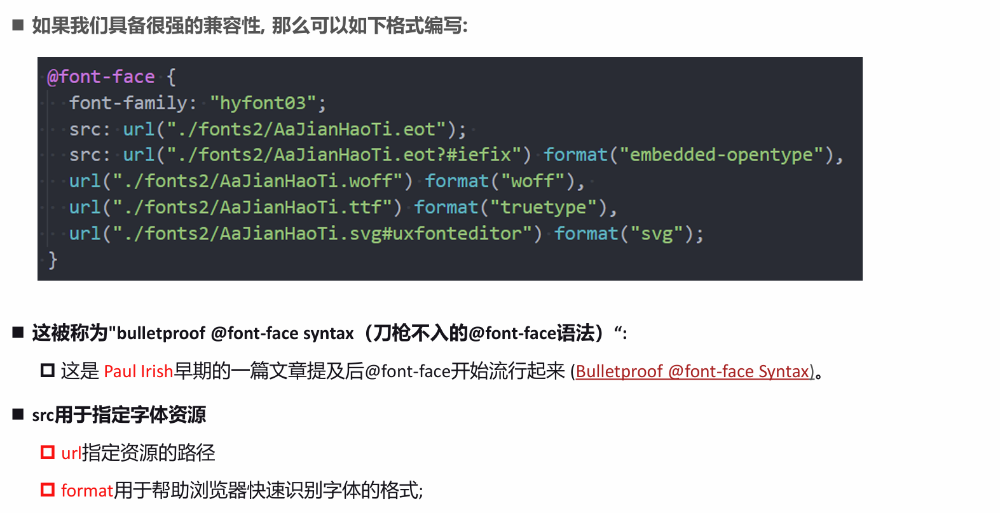

# 额外知识补充

## 1. link

- link 元素是外部资源链接元素，规范了文档与外部资源的关系
  - link 元素通常是在 head 元素中
- 最常用的链接是样式表（CSS）
  - 此外也可以被用来创建站点图标（比如“favicon” 图标）
- link 元素常见的属性：
  - href：此属性指定被链接资源的 URL。URL 可以是绝对的，也可以是相对的
  - rel：指定链接类型，常见的链接类型：https://developer.mozilla.org/zh-CN/docs/Web/HTML/Link_type
    - icon：站点图标
    - stylesheet：CSS 样式

## 2. 计算机进制

- 进制的概念
  - 当数字达到某个值时，进一位(比如从 1 位变成 2 位)。
- 二进制、八进制、十六进制?
  - 二进制（0b 开头, binary）：其中的数字由 0、1 组成，可以回顾之前学习过的机器语言
  - 八进制（0o 开头, Octonary）：其中的数字由 0~7 组成
  - 十六进制（0x 开头,hexadecimal）：其中的数字由 0~9 和字母 a-f 组成（大小写都可以）

## 3. CSS 表示颜色

- RGB 颜色可以通过以#为前缀的十六进制字符和函数（rgb()、rgba()）标记表示
- 方式一：十六进制符号：#RRGGBB[AA]
- 方式二：十六进制符号：#RGB[A]
- 方式三：函数符：rgb[a](R, G, B[, A])

## 4. Chorme 调试工具

- 快捷键：ctrl+可以调整页面或者调试工具的字体大小
- 可以通过删除某些元素来查看网页结构
- 可以通过增删 css 来调试网页样式

## 5. 浏览器渲染流程

## 6. border 图形

- border 主要是用来给盒子增加边框的, 但是在开发中我们也可以利用边框的特性来实现一些形状
- [在线制作](https://css-tricks.com/the-shapes-of-css/#top-of-site)

## 7. Web 字体

- 使用过程如下：
  - 1.将字体放到对应的目录中
  - 2.通过@font-face 来引入字体
  - 3.使用字体

### web-fonts 的兼容性

- 我们刚才使用的字体文件是.ttf, 它是 TrueType 字体.
  - 在开发中某些浏览器可能不支持该字体, 所以为了浏览器的兼容性问题, 我们需要有对应其他格式的字体;
- TrueType 字体：拓展名是 .ttf
- OpenType/TrueType 字体：拓展名是 .ttf、.otf，建立在 TrueType 字体之上
- Embedded OpenType 字体：拓展名是 .eot，OpenType 字体的压缩版
- SVG 字体：拓展名是.svg、.svgz
- WOFF 表示 Web Open Font Format web 开放字体：拓展名是.woff，建立在 TrueType 字体之上
- 这里我们提供一个网站来生产对应的字体文件:
  - https://font.qqe2.com/#暂时可用

## 8. 认识字体图标

- 字体可以设计成各式各样的形状，所以把字体直接设计成图标的样子
- 字体图标的好处：
  - 放大不会失真
  - 可以任意切换颜色
  - 用到很多个图标时，文件相对图片较小
- 字体图标的使用：
  - 登录[阿里 icons](https://www.iconfont.cn/)
  - 下载代码，并且拷贝到项目中

## 9. 认识精灵图 CSS Sprite

- 什么是 CSS Sprite
  - 是一种 CSS 图像合成技术，将各种小图片合并到一张图片上，然后利用 CSS 的背景定位来显示对应的图片部分
  - 有人翻译为：CSS 雪碧、CSS 精灵
- 使用 CSS Sprite 的好处
  - 减少网页的 http 请求数量，加快网页响应速度，减轻服务器压力
  - 减小图片总大小
  - 解决了图片命名的困扰，只需要针对一张集合的图片命名
- Sprite 图片制作（雪碧图、精灵图）
  - 方法 1：Photoshop, 设计人员提供
  - 方法 2：https://www.toptal.com/developers/css/sprite-generator
- 精灵图如何使用呢?
  - 精灵图的原理是通过只显示图片的很小一部分来展示的;
  - 通常使用背景:
    - 1.设置对应元素的宽度和高度
    - 2.设置精灵图作为背景图片
    - 3.调整背景图片的位置来展示
- 如何获取精灵图的位置
  - http://www.spritecow.com

## 10. cursor

- cursor 可以设置鼠标指针（光标）在元素上面时的显示样式
- cursor 常见的设值有
  - auto：浏览器根据上下文决定指针的显示样式，比如根据文本和非文本切换指针样式
  - default：由操作系统决定，一般就是一个小箭头
  - pointer：一只小手，鼠标指针挪动到链接上面默认就是这个样式
  - text：一条竖线，鼠标指针挪动到文本输入框上面默认就是这个样式
  - none：没有任何指针显示在元素上面
