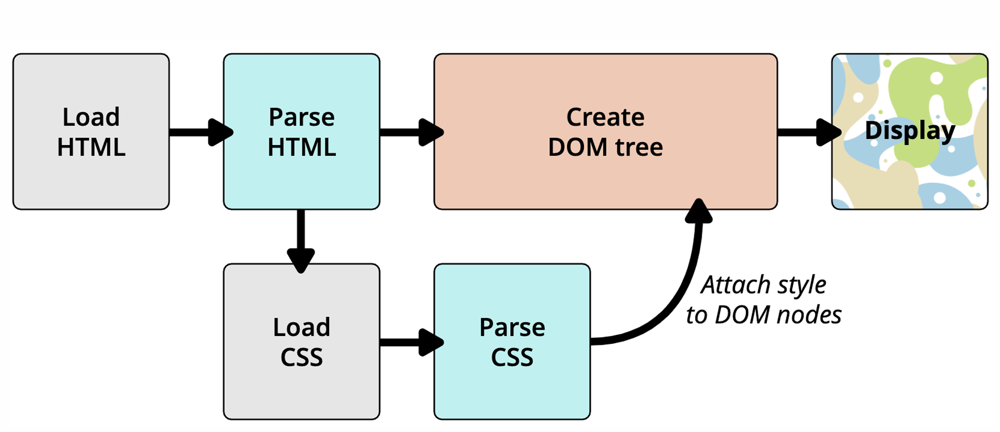

# 额外知识补充

## 1. link

- link 元素是外部资源链接元素，规范了文档与外部资源的关系
  - link 元素通常是在 head 元素中
- 最常用的链接是样式表（CSS）
  - 此外也可以被用来创建站点图标（比如“favicon” 图标）
- link 元素常见的属性：
  - href：此属性指定被链接资源的 URL。URL 可以是绝对的，也可以是相对的
  - rel：指定链接类型，常见的链接类型：https://developer.mozilla.org/zh-CN/docs/Web/HTML/Link_type
    - icon：站点图标
    - stylesheet：CSS 样式

## 2. 计算机进制

- 进制的概念
  - 当数字达到某个值时，进一位(比如从 1 位变成 2 位)。
- 二进制、八进制、十六进制?
  - 二进制（0b 开头, binary）：其中的数字由 0、1 组成，可以回顾之前学习过的机器语言
  - 八进制（0o 开头, Octonary）：其中的数字由 0~7 组成
  - 十六进制（0x 开头,hexadecimal）：其中的数字由 0~9 和字母 a-f 组成（大小写都可以）

## 3. CSS 表示颜色

- RGB 颜色可以通过以#为前缀的十六进制字符和函数（rgb()、rgba()）标记表示
- 方式一：十六进制符号：#RRGGBB[AA]
- 方式二：十六进制符号：#RGB[A]
- 方式三：函数符：rgb[a](R, G, B[, A])

## 4. Chorme 调试工具

- 快捷键：ctrl+可以调整页面或者调试工具的字体大小
- 可以通过删除某些元素来查看网页结构
- 可以通过增删 css 来调试网页样式

## 5. 浏览器渲染流程

