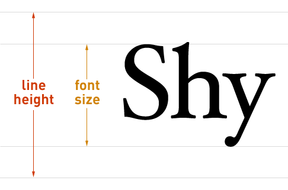

# CSS 文本属性-字体属性-选择器

## 1. 文本属性

### text-decoration

- 用于设置文字的装饰线
- 常见取值：
  - none：无任何装饰线
  - underline：下划线
  - overline：上划线
  - line-through：中划线（删除线）

### text-tramsform

- 用于设置文字的大小写转换
- 常见取值：
  - capitalize：使首字母大写
  - uppercase：全变成大写
  - lowercase：全变成小写
  - none：无

### text-indent

- 为文本添加首行缩进
- 可以使用 2em

### text-align

- 设置文本的水平对齐方式（其实不仅仅是文本）
- 其实是作用于 inline 级元素，效果是相对于父元素。
- 属性：
  - left
  - right
  - center
    - margin: 0 auto 也可以用来居中
  - justify：两端对齐
    - 防止有的单词太长，导致对不齐
    - 默认最后一行不生效，如果想生效，可以用 text-align-last

> 给父元素设置 center 后，其所有的 inline-level-box 都会居中

### white-space

- 设置 nowrap 可以保证不换行

### text-overflow

- 设置 ellipsis 可以用省略号

### word-letter-spaceing

- word-spacing：文字间的空白
- letter-spacing：字母间的空白

## 2. 字体属性

### font-size

- 决定文字的大小
- 单位：
  - em：相对于父元素的字体
  - 百分比：不确定相对于谁，最好查 MDN 文档

### font-family

- 用来设置字体
  - 一般设置一次就行，会继承
  - 可以设置一个或多个
  - 浏览器会选择第一个计算机上有的字体
  - 或者通过@font-face 指定的可以直接下载的字体

### font-weight

- 设置文字的粗细
- 属性：
  - 100 | 200 | 300
  - normal：400
  - bold：700

### font-style

- 设置字体风格
- 属性：
  - italic：斜体，会使用字体自身设置的斜体
  - oblique：直接倾斜
  - normal：常规显示

### font-variant

- 影响小写字母显示形式
- 设置属性 small-caps 后，会让小写字母的高度不变，但是显示形式变成大写

### line-height

- 用于设置文本的行高
  - 是一行文本占的高度
- 实际是两行文字基线（baseline）之间的间距
  - baseline 是文字底部对齐的线
- line-height 减去 font-size 后剩余的空间平均分配到上下空白
  - 所以只需要设置与盒子一样的 line-height，就可以实现文字垂直居中

### font 缩写属性

- font 属性可以用来作为 font-style, font-variant, font-weight, font-size, line-height 和 font-family 属性的简写
- font-style font-variant font-weight font-size/line-height font-family
- 规则：
  - font-style font-variant font-weight font-size/line-height font-family
  - /line-height 可以省略，如果不省略，必须跟在 font-size 后面
  - font-size、font-family 不可以调换顺序，不可以省略
