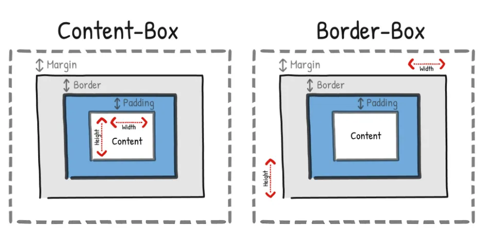
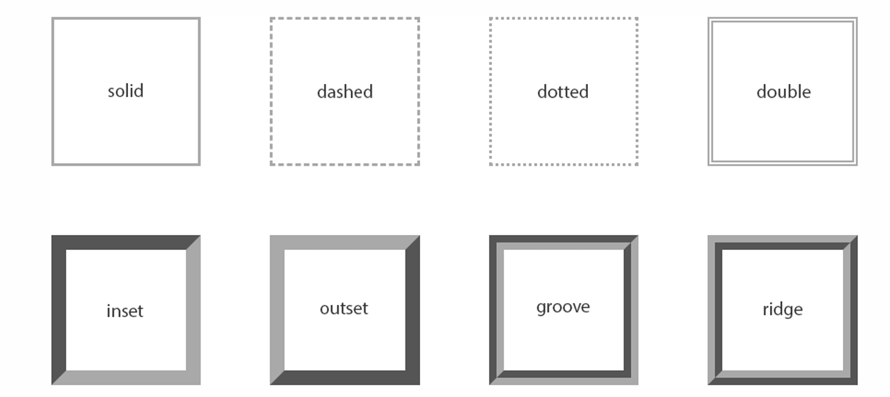
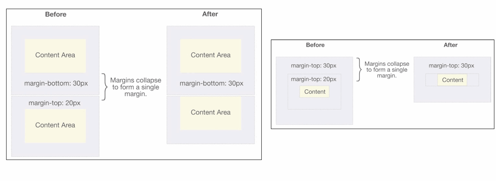

# CSS 盒子模型

## 认识盒子模型

一般具有四个属性

- 属性（content）
  - 元素内容 width/height
- 内边距（padding）
  - 元素和内容之间的间距
- 边框（border）
  - 元素自己的边框
- 外边距（margin）
  - 元素和其他元素之间的间距
- 每个属性有四个边

- 设置内容是通过宽度和高度设置的
  - 移动端适配时, 可以设置最大宽度和最小宽度
  - min-width：最小宽度，无论内容多少，宽度都大于或等于 min-width
  - max-width：最大宽度，无论内容多少，宽度都小于或等于 max-width
  - min-height max-height 不常用

> 居中补充:
> `text-align` 用于 inline level;
> `margin: 0 auto` 用于 block level

!> 注意: 对于行内级非替换元素来说, 设置宽高是无效的!

## 盒子模型属性

### 内边距 - padding

- padding 缩写属性
  - 从上开始，顺时针转动
  - 如果有三个值，left = right
  - 如果两个值，就是上下左右一样
  - 如果一个值，全部都一样

### 边框 - border

- 用于设置盒子的边框
  - 边框有宽度 width
    - border-width 是 4 个属性的简写属性
  - 宽度有样式 style
    - border-style 是上面 4 个属性的简写属性
    - 有很多种类，具体可以去看看文档
  - 边框有颜色 color
    - border-color 是上面 4 个属性的简写属性
- 可以用 border 直接缩写三个大属性，任意顺序

- border-radius 圆角
  - 属性：
    - 数值
    - 百分比，在水平和垂直方向会分别计算
  - 如果一个元素是正方形, 设置 border-radius 大于或等于 50%时，就会变成一个圆

### 外边距 - margin

- margin 属性用于设置盒子的外边距, 通常用于元素和元素之间的间距
- margin 包括四个方向，margin 是缩写属性
- margin 也并非必须是四个值, 也可以有其他值

> 建议是父子关系之间用 padding，兄弟关系之间用 margin

- margin 的上下传递问题
  - 要清楚，左右是不会传递的
  - margin-top: 如果块级元素的顶部线和父元素的顶部线重叠，那么这个块级元素的 margin-top 值会传递给父元素
  - margin-bottom: 如果块级元素的底部线和父元素的底部线重写，并且父元素的高度是 auto，那么这个块级元素的 margin-bottom 值会传递给父元素
  - 如何防止出现传递问题
    - 给父元素设置 padding-top\padding-bottom
    - 给父元素设置 border
    - 触发 BFC: 设置 overflow 为 auto
- margin 的上下折叠问题
  - 垂直方向上相邻的 2 个 margin（margin-top、margin-bottom）有可能会合并为 1 个 margin，这种现象叫做 collapse（折叠）
  - 水平方向上的 margin（margin-left、margin-right）永远不会 collapse
  - 折叠后最终值的计算规则
    - 两个值进行比较，取较大的值
  - 为了防止折叠，最好只设置一个 margin
  - 两种可能
    - 两个兄弟块级元素之间上下 margin 的折叠
    - 两个兄弟块级元素之间上下 margin 的折叠

