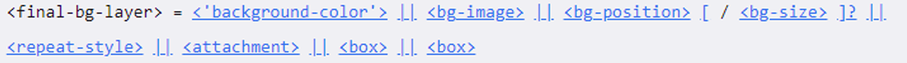
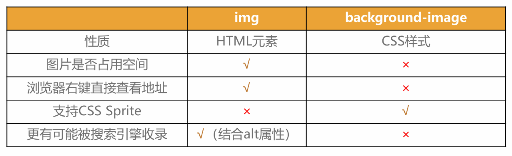

# CSS 设置背景

## 1. 各种属性

### background-image

- 用于设置元素的背景照片
  - 会盖在 background-color 的上面
  - 设置多张，会不断盖上去
  - 必须设置尺寸，不然不显示

### background-repeat

- 用于设置图片是否平铺（重复放图片）
  - 属性
    - repeat：平铺
    - no-repeat：不平铺
    - repeat-x：在水平方向平铺
    - repeat-y：在垂直方向平铺
  - 应用
    - 做一些好看的背景图等

### background-size

- 用于设置背景图片的大小
  - 属性
    - auto：默认值, 以背景图本身大小显示
    - cover：缩放背景图，以完全覆盖铺满元素,可能背景图片部分看不见
    - contain：缩放背景图，宽度或者高度铺满元素，但是图片保持宽高比
    - `<percentage>`：百分比，相对于背景区（background positioning area）
    - length：具体的大小，比如 100px

### background-position

- 用于设置图片的位置
  - 可以设置具体的数值比如 20px 30px;
  - 水平方向还可以设值：left、center、right
  - 垂直方向还可以设值：top、center、bottom
  - 如果只设置了 1 个方向，另一个方向默认是 center
- 应用
  - 如果你想让一张大图，在浏览器缩放的适合始终展示中间的内容，可以设置这个属性

### background-attachment

- 决定背景图像的位置是在视口内固定，或者随着包含它的区块滚动。
  - 属性
    - scroll：随着浏览器整体变化
    - local：随着任何东西变化
    - fixed：写死不动
  - [演示链接](https://developer.mozilla.org/en-US/docs/Web/CSS/background-attachment)

### background 简写属性

- 语法  
  
- background-size 可以省略，如果不省略，/background-size 必须紧跟在 background-position 的后面
- 其他属性也都可以省略，而且顺序任意

## 2. background-image Vs img

- 总结
  - img，作为网页内容的重要组成部分，比如广告图片、LOGO 图片、文章配图、产品图片
  - background-image，可有可无。有，能让网页更加美观。无，也不影响用户获取完整的网页内容
