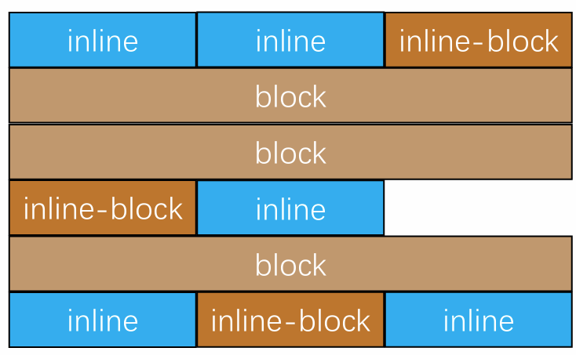
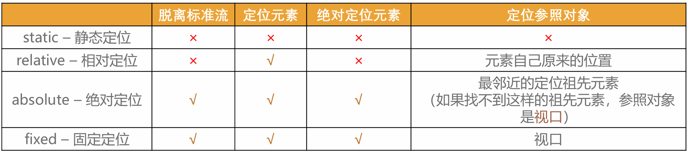

# CSS 元素定位

## 1. 标准流（Normal flow）

- 默认情况下，元素都是按照 normal flow（标准流、常规流、正常流、文档流【document flow】）进行排布
  - 从左到右、从上到下按顺序摆放好
  - 默认情况下，互相之间不存在层叠现象

- 在标准流中，可以使用 margin、padding 对元素进行定位
  - 其中 margin 还可以设置负数
- 比较明显的缺点是
  - 设置一个元素的 margin 或者 padding，通常会影响到标准流中其他元素的定位效果
  - 不便于实现元素层叠的效果
- 如果我们希望一个元素可以跳出标准量,单独的对某个元素进行定位呢?
  - 我们可以通过 position 属性来进行设置;

## 2. 元素的定位

- 定位允许您从正常的文档流布局中取出元素，并使它们具有不同的行为:
  - 例如放在另一个元素的上面;
  - 或者始终保持在浏览器视窗内的同一位置;
- 默认值:
  - static：默认值, 静态定位
- 使用下面的值, 可以让元素变成定位元素(positioned element)
  - relative：相对定位
  - absolute：绝对定位
  - fixed：固定定位
  - sticky：粘性定位

### static

- position 属性的默认值
  - 元素按照 normal flow 布局
  - left 、right、top、bottom 没有任何作用

### relative

- 元素按照 normal flow 布局
- 可以通过 left、right、top、bottom 进行定位
  - 定位参照对象是元素自己原来的位置
- 相对定位的应用场景
  - 在不影响其他元素位置的前提下，对当前元素位置进行微调

### fixed

- 元素脱离 normal flow（脱离标准流、脱标）
- 可以通过 left、right、top、bottom 进行定位
  - 定位参照对象是视口（viewport）
  - 当画布滚动时，固定不动

### Viewport && Canvas

- 视口（Viewport）
  - 文档的可视区域
  - 如右图红框所示
- 画布（Canvas）
  - 用于渲染文档的区域
  - 文档内容超出视口范围，可以通过滚动查看
- 宽高对比
  - 画布>= 视口

### absolute

- 元素脱离 normal flow（脱离标准流、脱标）
- 可以通过 left、right、top、bottom 进行定位
  - 定位参照对象是最邻近的**定位祖先元素**
  - 如果找不到这样的祖先元素，参照对象是视口
- 定位元素（positioned element）
  - position 值不为 static 的元素
  - 也就是 position 值为 relative、absolute、fixed 的元素

#### 子绝父相

- 在绝大数情况下，子元素的绝对定位都是相对于父元素进行定位
- 如果希望子元素相对于父元素进行定位，又不希望父元素脱标，常用解决方案是：
  - 父元素设置 position: relative（让父元素成为定位元素，而且父元素不脱离标准流）
  - 子元素设置 position: absolute
  - 简称为“子绝父相”

> 只是一种简称，实际上子绝父绝也完全可以的

#### 将 position 设置为 absolute/fixed 元素的特点

- 可以随意设置宽高
- 宽高默认由内容决定
- 不再受标准流的约束
  - 不再严格按照从上到下、从左到右排布
  - 不再严格区分块级(block)、行内级(inline)，行内块级(inline-block)的很多特性都会消失
- **不再给父元素汇报宽高数据**
  - 比如 div 的高度是由内容决定的，如果子元素变成了 absolute，会导致 div 没有高度
- 脱标元素内部默认还是按照标准流布局
- 绝对定位元素（absolutely positioned element）
  - position 值为 absolute 或者 fixed 的元素
- 对于绝对定位元素来说
  - 定位参照对象的宽度= left + right + margin-left + margin-right + 绝对定位元素的实际占用宽度
  - 定位参照对象的高度= top + bottom + margin-top + margin-bottom + 绝对定位元素的实际占用高度
- 如果希望绝对定位元素的宽高和定位参照对象一样，可以给绝对定位元素设置以下属性
  -left: 0、right: 0、top: 0、bottom: 0、margin:0
- 如果希望绝对定位元素在定位参照对象中居中显示，可以给绝对定位元素设置以下属性
  - left: 0、right: 0、top: 0、bottom: 0、margin: auto
  - 另外，还得设置具体的宽高值（宽高小于定位参照对象的宽高）

### sticky

- sticky，比起其他定位值要新一些，sticky 是一个大家期待已久的属性;
  - 可以看做是相对定位和固定(绝对)定位的结合体;
  - 它允许被定位的元素表现得像相对定位一样，直到它滚动到某个阈值点;
  - 当达到这个阈值点时, 就会变成固定(绝对)定位;
- sticky 是相对于最近的滚动祖先包含滚动视口的(the nearest ancestor scroll container’s scrollport )

## 3. Summary

## 4. z-index

- z-index 属性用来设置定位元素的层叠顺序（仅对定位元素有效）
  - 取值可以是正整数、负整数、0
- 比较原则
  - 如果是兄弟关系
    - z-index 越大，层叠在越上面
    - z-index 相等，写在后面的那个元素层叠在上面
  - 如果不是兄弟关系
    - 各自从元素自己以及祖先元素中，找出最邻近的 2 个定位元素进行比较
    - 而且这 2 个定位元素必须有设置 z-index 的具体数值
