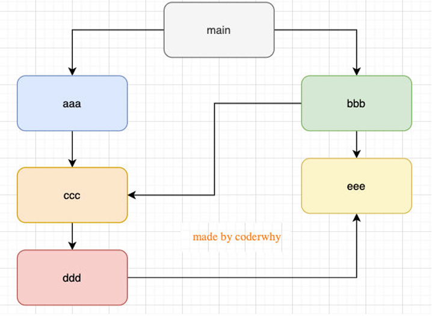

# 模块化开发 - CommonJS

## 认识模块化开发

- 何为程序化开发
  - 最终目的是将程序划分为一个个小的结构
  - 每个结构中写自己的代码，由自己的作用域，定义变量名词的时候不会影响其他结构
  - 可以选择暴露变量、函数、对象等，用来给其他结构使用
  - 也可以导入其他结构的变量、函数、对象等
- ECMA 没有推出自己的模块化方案，社区提供了一种规范：CommonJS/AMD/CMD
- 直到 ES6，推出了官方方案 ES Module

> 以前会用 IIFE 来解决作用域的问题，但任然很麻烦

## CommonJS 规范和 Node 的关系

- Node 是 CommonJS 在服务器端一个具有代表性的实现
- Browserify 是 CommonJS 在浏览器的一个实现
- webpack 打包工具具备对 CommonJS 的支持和转换
- Node 已经支持实现了 CommonJS，但是浏览器默认没有实现，也就是不能使用
  - 在 Node 中，每一个文件都是一个模块，已经实现了规范
  - export 和 module.exports 可以负责对模块中的内容进行导出
  - require 用来导入其他模块的内容

## exports 导出

- exports 是一个对象，我们可以在这个对象中添加很多个属性，添加的属性会导出
- 理解下面的代码
  - exports 的本质是一个对象
  - require 通过各种查找方式，最终找到了 exports 这个对象，返回了 exports 对象的地址
  - 并且将这个 exports 对象赋值给了 bar 变量，bar 变量就是 exports 对象了；
  - 本质是一个引用赋值

```js
// 第一个文件 bar.js
const name = ziwen;

exports.name = name; // exports的本质是一个对象
// 第二个文件 foo.js
const bar = require("./bar");
const { name } = require("./bar"); // 直接对其解构
```

## module.exports 导出

- 我们在 Node 中导出东西的时候，一般会使用 module.exports 来导出
- 实际上，我们 module.exports 是 module 类的一个属性，它的默认指向就是 exports 对象，所以其实和上述的代码是一样的效果
- 但是如果我们使用`module.exports = {}`，这样我们就指向了一个新的对象，这样就不在指向默认的 exports 对象了
- 那 Node 为何要多次一举呢，因为 CommonJS 是没有 module.exports 的概念的，但是实际上 Node 导出时实际上会导出 module.exports，为了实现规范，所以我们要有一个 export 对象，让 module.exports 和 exports 有相同的指针

> 每个模块其实都会被抽象为一个 module 对象

## require 细节

- require 是一个函数，可以帮助我们来导入一个模块中导出的对象
- require 的规则
  - `require(X)`
  - 1. 若 X 是一个 Node 核心模块，比如 path、http，则会直接返回核心模块
  - 2. 若 X 以./ 或../ 或/（根目录）开头的，则会把 X 当作一个文件在对应的目录查找
    - 若有后缀名，则会直接查找
    - 若没有后缀名，则会认为 X 是一个目录，接着查找 X 目录下的 index 文件，查找顺序：
      - X/index.js
      - X/index.json
      - X/index.node
    - 如果没有找到，则会报错：not found
  - 3. 直接是一个 X（没有路径），并且 X 不是一个核心模块
    - `/Users/username/Desktop/Node/TestCode/main.js` 中编写 require('why’)
    - 会一层层查找
      - `TestCode/node_modules`
      - `Node/TestCode/main.js/node_modules`
      - ...以此类推，直到
      - /Users/node_modules
    - 如果没有找到，则会报错：not found

## 模块的加载过程解析

- 模块第一次被引入时，会首先全部执行一次
- 模块多次被引入，会缓存，最终只会执行一次
  - 每个模块对象 module 都有一个属性：loaded
  - false 表示没有加载，true 表示加载
- 模块有循环引用，会采用深度优先算法
  - 涉及到数据结构的图结构，有深度和广度优先搜索两种算法
  - Node 中采用深度优先算法：main->aaa->ccc->ddd->eee->bbb



## CommonJS 规范缺点

- CommonJS 加载模块是同步的：
  - 同步的意味着只有等到对应的模块加载完毕，当前模块中的内容才能被运行；
  - 这个在服务器不会有什么问题，因为服务器加载的 js 文件都是本地文件，加载速度非常快；
- 如果将它应用于浏览器呢？
  - 浏览器加载 js 文件需要先从服务器将文件下载下来，之后再加载运行；
  - 那么采用同步的就意味着后续的 js 代码都无法正常运行，即使是一些简单的 DOM 操作；
- 所以在浏览器中，我们通常不使用 CommonJS 规范：
  - 当然在 webpack 中使用 CommonJS 是另外一回事；
  - 因为它会将我们的代码转成浏览器可以直接执行的代码；
- 在早期为了可以在浏览器中使用模块化，通常会采用 AMD 或 CMD：
  - 但是目前一方面现代的浏览器已经支持 ES Modules，另一方面借助于 webpack 等工具可以实现对 CommonJS 或者 ES Module 代码的转换；
  - AMD 和 CMD 已经使用非常少了；

## AMD 规范（了解）

- AMD 是应用于浏览器的一种模块化规范
  - AMD 是 Asynchronous Module Definition（异步模块定义）的缩写；
  - 它采用的是异步加载模块；
  - 事实上 AMD 的规范还要早于 CommonJS，但是 CommonJS 目前依然在被使用，而 AMD 使用的较少了；
- 规范只是定义代码的应该如何去编写，只有有了具体的实现才能被应用：
  - AMD 实现的比较常用的库是 require.js 和 curl.js；

## CMD 规范（了解）

- CMD 规范也是应用于浏览器的一种模块化规范：
- CMD 是 Common Module Definition（通用模块定义）的缩写；
  - 它也采用的也是异步加载模块，但是它将 CommonJS 的优点吸收了过来；
  - 但是目前 CMD 使用也非常少了；
- CMD 也有自己比较优秀的实现方案：
  - SeaJS
