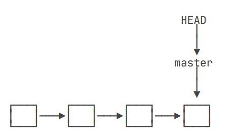
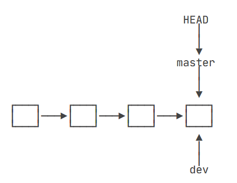

# Section5-分支管理(Part1)

一个属于你自己的分支，别人看不到，还继续在原来的分支上正常工作，而你在自己的分支上干活，想提交就提交，直到开发完毕后，再一次性合并到原来的分支上，这样，既安全，又不影响别人工作。

## 1. 创建与合并分支

一开始的时候，master 分支是一条线，Git 用 master 指向最新的提交，再用 HEAD 指向 master，就能确定当前分支，以及当前分支的提交点


每次提交，master 分支都会向前移动一步，这样，随着你不断提交，master 分支的线也越来越长。

当我们创建新的分支，例如 dev 时，Git 新建了一个指针叫 dev，指向 master 相同的提交，再把 HEAD 指向 dev，就表示当前分支在 dev 上：


你看，Git 创建一个分支很快，因为除了增加一个 dev 指针，改改 HEAD 的指向，工作区的文件都没有任何变化！

不过，从现在开始，对工作区的修改和提交就是针对 dev 分支了，比如新提交一次后，dev 指针往前移动一步，而 master 指针不变：


假如我们在 dev 上的工作完成了，就可以把 dev 合并到 master 上。Git 怎么合并呢？最简单的方法，就是直接把 master 指向 dev 的当前提交，就完成了合并：  


所以 Git 合并分支也很快！就改改指针，工作区内容也不变！

合并完分支后，甚至可以删除 dev 分支。删除 dev 分支就是把 dev 指针给删掉，删掉后，我们就剩下了一条 master 分支：  


## 2. 实战代码

1. 创建分支

```
git checkout -b dev
```

命令加上`-b`参数表示创建并切换，相当于以下两条命令：

```
$ git branch dev
$ git checkout dev
```

2. 查看当前分支

然后，用`git branch`命令查看当前分支，命令会列出所有分支，当前分支前面会标一个`*`号，然后，我们就可以在 dev 分支上正常提交。

3. 合并分支

现在，`dev`分支的工作完成，我们就可以切换回`master`分支：  


现在，我们把 dev 分支的工作成果合并到 master 分支上：

```
$ git merge dev
```

git merge 命令用于合并指定分支到当前分支。

注意到上面的 Fast-forward 信息，Git 告诉我们，这次合并是“快进模式”，也就是直接把 master 指向 dev 的当前提交，所以合并速度非常快。

当然，也不是每次合并都能 Fast-forward，我们后面会讲其他方式的合并。

合并完成后，就可以放心地删除 dev 分支了：

```
git branch -d dev
```

## 3. 切换分支

我们注意到切换分支使用 `git checkout <branch>`，而前面讲过的撤销修改则是 `git checkout -- <file>`，同一个命令，有两种作用，确实有点令人迷惑。

实际上，切换分支这个动作，用 `switch` 更科学。

因此，最新版本的 Git 提供了新的 `git switch` 命令来切换分支:

创建并切换到新的 dev 分支，可以使用：

```
$ git switch -c dev
```

直接切换到已有的 master 分支，可以使用：

```
$ git switch master
```

## 4. 小结

Git 鼓励大量使用分支：

查看分支：`git branch`

创建分支：`git branch <name>`

切换分支：`git checkout <name>`或者 `git switch <name>`

创建+切换分支：`git checkout -b <name>`或者 `git switch -c <name>`

合并某分支到当前分支：`git merge <name>`

删除分支：`git branch -d <name>`
