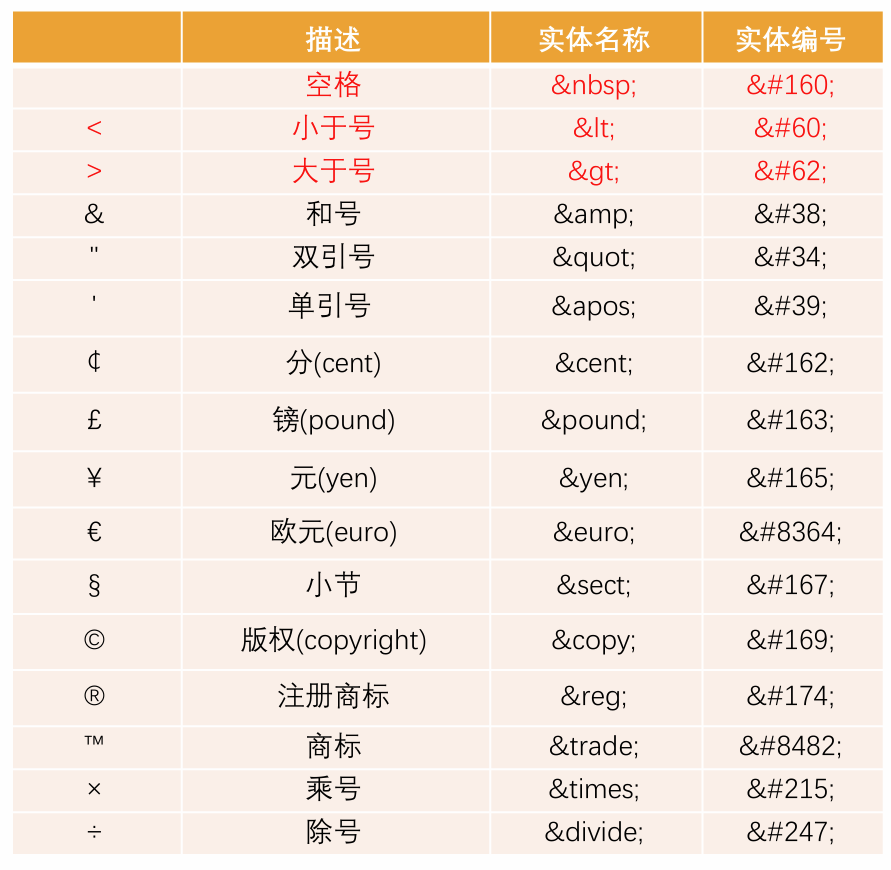
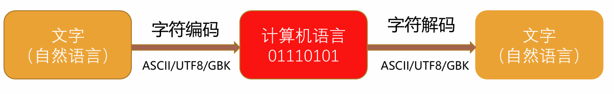

# 额外补充知识

## 1. 字符实体

- 我们编写的 HTML 代码会被浏览器解析
- 浏览器解析：
  - 如果你使用小于号（<），浏览器会将其后的文本解析为一个 tag。
  - 但是某些情况下，我们确实需要编写一个小于号（<）
  - 这个时候我们就可以使用字符实体
- HTML 实体是一段以连字号（&）开头、以分号（;）结尾的文本（字符串）
  - 实体常常用于显示保留字符（这些字符会被解析为 HTML 代码）和不可见的字符（如“不换行空格”）
  - 你也可以用实体来代替其他难以用标准键盘键入的字符（比如空格）

## 2. URL 地址

- URL (Uniform Resource Locator)：代表一个给定的独特资源在 Web 上的地址
  - 理论上，每个有效的 URL 都指向一个唯一的资源
  - 这个资源可以是 HTML，CSS，一个图片等等
- URL 格式
  - [协议类型]://[服务器地址]:[端口号]/[文件路径][文件名]?[查询]#[片段 ID]
- URL 和 URI 的区别
  - URI = Uniform Resource Identifier 统一资源标志符，用于标识 Web 技术使用的逻辑或物理资源，不一定是网络地址
  - URL = Uniform Resource Locator 统一资源定位符，俗称网络地址，相当于网络中的门牌号
  - URL 是 URI 的子集

## 3. 元素语义化

- 好处：
  - 方便代码维护
  - 减少让开发者之间的沟通成本
  - 能让语音合成工具正确识别网页元素的用途，以便作出正确的反应
  - 有利于 SEO

## 4. SEO 优化

- 搜索引擎优化（英语：search engine optimization，缩写为 SEO）是通过了解搜索引擎的运作规则来调整网站，以及提高网站在有关搜索引擎内排名的方式。

## 5. 字符编码

- 为了在计算机上也能表示、存储和处理像文字、符号等等之类的字符，就必须将这些字符转换成二进制数字
  - 当然，肯定不是我们想怎么转换就怎么转换，否则就会造成同一段二进制数字在不同计算机上显示出来的字符不一样的情况，因此必须得定一个统一的、标准的转换规则
  - [coderwhy 参考文章](https://www.jianshu.com/p/899e749be47c)

