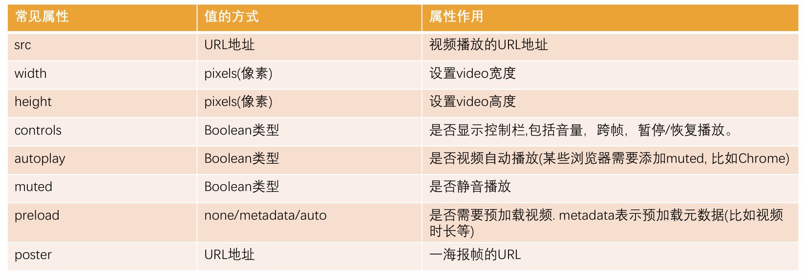
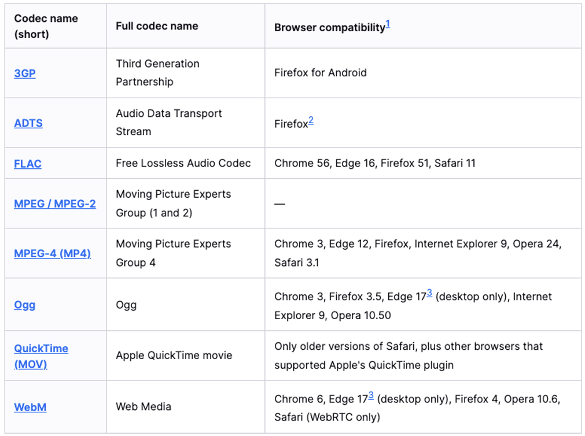
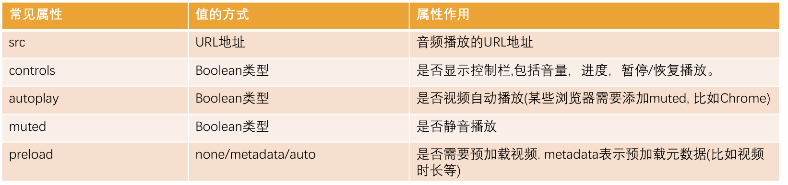

# HTML5

## 1. HTML5 新增元素

- 在 HMTL5 之前，我们的网站分布层级通常包括哪些部分呢？
  - header、nav、main、footer
- 但是这样做有一个弊端：
  - 我们往往过多的使用 div, 通过 id 或 class 来区分元素；
  - 对于浏览器来说这些元素不够语义化；
  - 对于搜索引擎来说, 不利于 SEO 的优化；
- HTML5 新增了语义化的元素：
  - `<header>`：头部元素
  - `<nav>`：导航元素
  - `<section>`：定义文档某个区域的元素
  - `<article>`：内容元素
  - `<aside>`：侧边栏元素
  - `<footer>`：尾部元素
- Web 端事实上一直希望可以更好的嵌入音频和视频, 特别是 21 世纪以来, 用户带宽的不断提高, 浏览器因为和视频变得非常容易.
- 在 HTML5 之前是通过 flash 或者其他插件实现的, 但是会有很多问题;
- 比如无法很好的支持 HTML/CSS 特性, 兼容性问题等等;
- HTML5 增加了对媒体类型的支持：
  - 音频：`<audio>`
  - 视频：`<video>`
- Video 和 Audio 使用方式有两个：
  - 一方面我们可以直接通过元素使用 video 和 autio；
  - 另一方面我们可以通过 JavaScript 的 API 对其进行控制；

## 2. video

- HTML`<video>` 元素用于在 HTML 中嵌入媒体播放器，用于支持文档内的视频播放。
  - 是行内替换元素
  - assets 来存放资源
  - `<video src=""></video>`




> 浏览器不希望视频会直接播放，一般打开静音后浏览器就会允许你自动播放

- 在`<video>`元素中间的内容，是针对浏览器不支持此元素时候的降级处理。
  - 内容一：通过`<source>`元素指定更多视频格式的源;
  - 内容二：通过 p/div 等元素指定在浏览器不支持 video 元素的情况, 显示的内容

## 3. audio

- HTML `<audio>` 元素用于在文档中嵌入音频内容, 和 video 的用法非常类似
  - 是行内替换元素
  - assets 来存放资源
  - `<audio src=""></audio>`



> 浏览器不希望视频会直接播放，一般打开静音后浏览器就会允许你自动播放

- 具体的支持的格式可以通过下面的链接查看:
  - [MDN 文档](https://developer.mozilla.org/en-US/docs/Web/Media/Formats/Audio_codecs)
- 在`<video>`元素中间的内容，是针对浏览器不支持此元素时候的降级处理。
  - 内容一：通过`<source>`元素指定更多视频格式的源;
  - 内容二：通过 p/div 等元素指定在浏览器不支持 video 元素的情况, 显示的内容

## 4. input 元素的扩展内容

- HTML5 对 input 元素也进行了扩展，在之前我们已经学习过的其中几个属性也是 HTML5 的特性：
  - placeholder：输入框的占位文字
  - multiple：多个值，用于`<select>`
  - autofocus：自动聚焦
- 另外对于 input 的 type 值也有很多扩展：
  - date
  - time
  - number
  - tel
  - color
  - email
  - [MDN 文档](https://developer.mozilla.org/zh-CN/docs/Web/HTML/Element/Input)

## 5. 新增全局属性 data-\*

- 在 HTML5 中, 新增一种全局属性的格式 data-\*, 用于自定义数据属性:
  - data 设置的属性可以在 JavaScript 的 DOM 操作中通过 dataset 轻松获取到；
  - 通常用于 HTML 和 JavaScript 数据之间的传递；
- 在小程序中, 就是通过 data-来传递数据的, 所以该全局属性必须要掌握.

```HTML
<div class="box" title"abc" data-name="ziwen">
  box
</div>
<script>
  const boxEL = document.querySelector(.box);
  console.log(boxEL.dataset);
</script>
```
