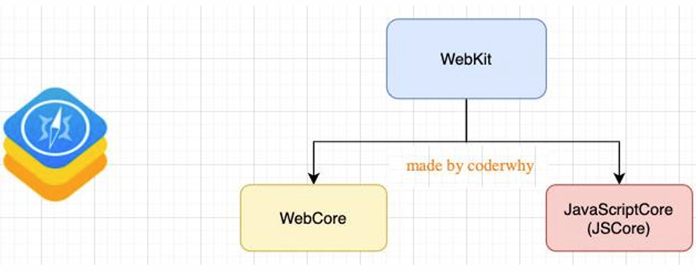
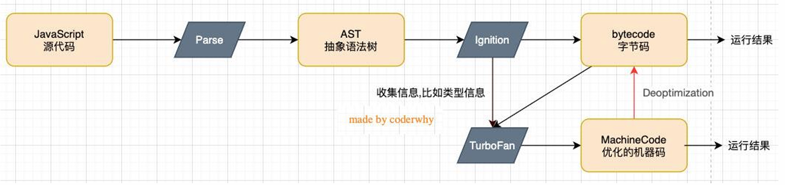
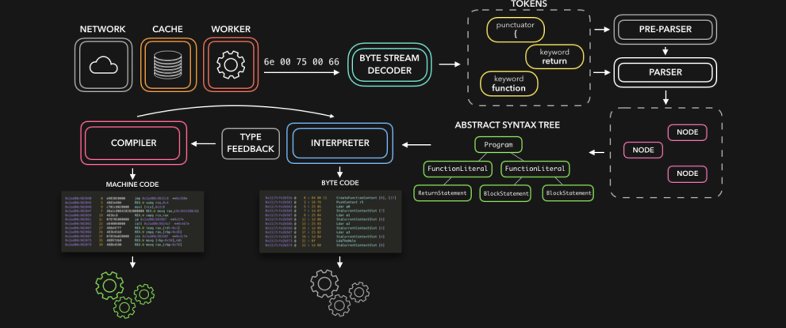

# JavaScript 的运行原理

## 深入 V8 引擎原理

- 我们知道，浏览器内核是由两部分组成的，以 webkit 为例：
  - WebCore：负责 HTML 解析、布局、渲染等等相关的工作；
  - JavaScriptCore：解析、执行 JavaScript 代码；
    - 另外一个强大的 JavaScript 引擎就是 V8 引擎。



### V8 引擎的执行原理

- V8 是用 C ++编写的 Google 开源高性能 JavaScript 和 WebAssembly 引擎，它用于 Chrome 和 Node.js 等。
- 它实现 [ECMAScript](https://tc39.es/ecma262/) 和 [WebAssembly](https://webassembly.github.io/spec/core/)，并在 Windows 7 或更高版本，macOS 10.12+和使用 x64，IA-32，ARM 或 MIPS 处理器的 Linux 系统上运行。
- V8 可以独立运行，也可以嵌入到任何 C ++应用程序中



### V8 引擎的架构

- V8 引擎本身的源码非常复杂，大概有超过 100w 行 C++代码，通过了解它的架构，我们可以知道它是如何对 JavaScript 执行的：
- Parse 模块会将 JavaScript 代码转换成 AST（抽象语法树），这是因为解释器并不直接认识 JavaScript 代码；
  - 如果函数没有被调用，那么是不会被转换成 AST 的；
  - Parse 的 V8 [官方文档](https://v8.dev/blog/scanner)
- Ignition 是一个解释器，会将 AST 转换成 ByteCode（字节码）
  - 同时会收集 TurboFan 优化所需要的信息（比如函数参数的类型信息，有了类型才能进行真实的运算）；
  - 如果函数只调用一次，Ignition 会解释执行 ByteCode；
  - Ignition 的 V8 [官方文档](https://v8.dev/blog/ignition-interpreter)
- TurboFan 是一个编译器，可以将字节码编译为 CPU 可以直接执行的机器码；
  - 如果一个函数被多次调用，那么就会被标记为热点函数，那么就会经过 TurboFan 转换成优化的机器码，提高代码的执行性能；
  - 但是，机器码实际上也会被还原为 ByteCode，这是因为如果后续执行函数的过程中，类型发生了变化（比如 sum 函数原来执行的是 number 类型，后来执行变成了 string 类型），之前优化的机器码并不能正确的处理运算，就会逆向的转换成字节码；
  - TurboFan 的 V8 [官方文档](https://v8.dev/blog/turbofan-jit)
- 词法分析（英文 lexical analysis）
  - scanner 来处理
  - 将字符序列转换成 token 序列的过程。
  - token 是记号化（tokenization）的缩写
  - 词法分析器（lexical analyzer，简称 lexer），也叫扫描器（scanner）
- 语法分析（英语：syntactic analysis，也叫 parsing）
  - parser 来处理
  - 语法分析器也可以称之为 parser。




## JavaScript 代码执行原理

### 初始化全局对象

- js 引擎会在执行代码之前，会在堆内存中创建一个全局对象：Global Object（GO）
  - 该对象所有的作用域（scope）都可以访问；
  - 里面会包含 Date、Array、String、Number、setTimeout、setInterval 等等；
  - 其中还有一个 window 属性指向自己；

### 执行上下文（Execution Contexts ）

- js 引擎内部有一个执行上下文栈（Execution Context Stack，简称 ECS），它是用于执行代码的调用栈。
- 那么现在它要执行谁呢？执行的是全局的代码块：
  - 全局的代码块为了执行会构建一个 Global Execution Context（GEC）；
  - GEC 会被放入到 ECS 中执行；
- GEC 被放入到 ECS 中里面包含两部分内容：
  - 第一部分：在代码执行前，在 parser 转成 AST 的过程中，会将全局定义的变量、函数等加入到 GlobalObject 中，但是并不会赋值；
    - 这个过程也称之为变量的作用域提升（hoisting）
  - 第二部分：在代码执行中，对变量赋值，或者执行其他的函数；

### 认识 VO 对象（Variable Object）

- 每一个执行上下文会关联一个 VO（Variable Object，变量对象），变量和函数声明会被添加到这个 VO 对象中。
- 当全局代码被执行的时候，VO 就是 GO 对象了
- 对于函数代码来说，VO 是 FO

### 函数的执行

- 在执行的过程中执行到一个函数时，就会根据函数体创建一个函数执行上下文（Functional Execution Context，简称 FEC），并且压入到 EC Stack 中。
- 因为每个执行上下文都会关联一个 VO，那么函数执行上下文关联的 VO 是什么呢？
  - 当进入一个函数执行上下文时，会创建一个 AO 对象（Activation Object）；
  - 这个 AO 对象会使用 arguments 作为初始化，并且初始值是传入的参数；
  - 这个 AO 对象会作为执行上下文的 VO 来存放变量的初始化；

## 作用域和作用域链（Scope Chain）

- 当进入到一个执行上下文时，执行上下文也会关联一个作用域链（Scope Chain）
  - 作用域链是一个对象列表，用于变量标识符的求值；
  - 当进入一个执行上下文时，这个作用域链被创建，并且根据代码类型，添加一系列的对象；
- 首先会在自己的作用域去寻找变量，如果无法找到，就沿着作用域链向上一层层查找

## 作用域提升面试题

```js
var n = 100;
function foo() {
  n = 200;
}
foo();

console.log(n); // 200
```

```js
function foo() {
  console.log(n); // undefined
  var n = 200;
  console.log(n); // 200
}

var n = 100;
foo();
```

```js
var n = 100;

function foo1() {
  console.log(n); // 100
}

function foo2() {
  var n = 200;
  console.log(n); // 200
  foo1();
}

foo2();
console.log(n); // 100
```

```js
var a = 100;
function foo() {
  console.log(a); // undefined
  return;
  var a = 100;
}

foo();
```

```js
function foo() {
  var a = (b = 100); //相当于var a = 100; b = 100，没有用var去声明b，b会添加到window中
}

foo();
console.log(a); // undefined
console.log(b); // 100
```
