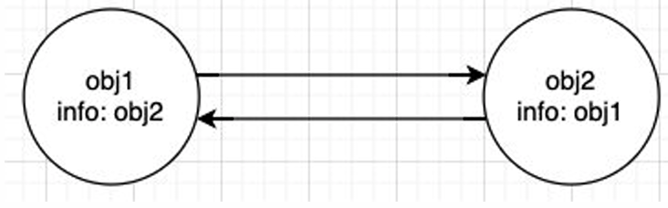
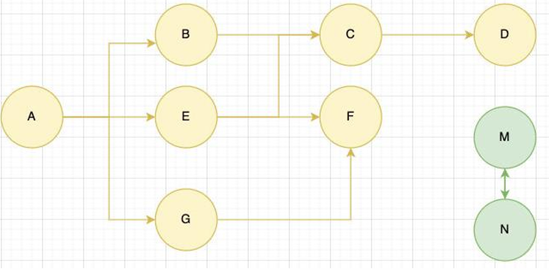
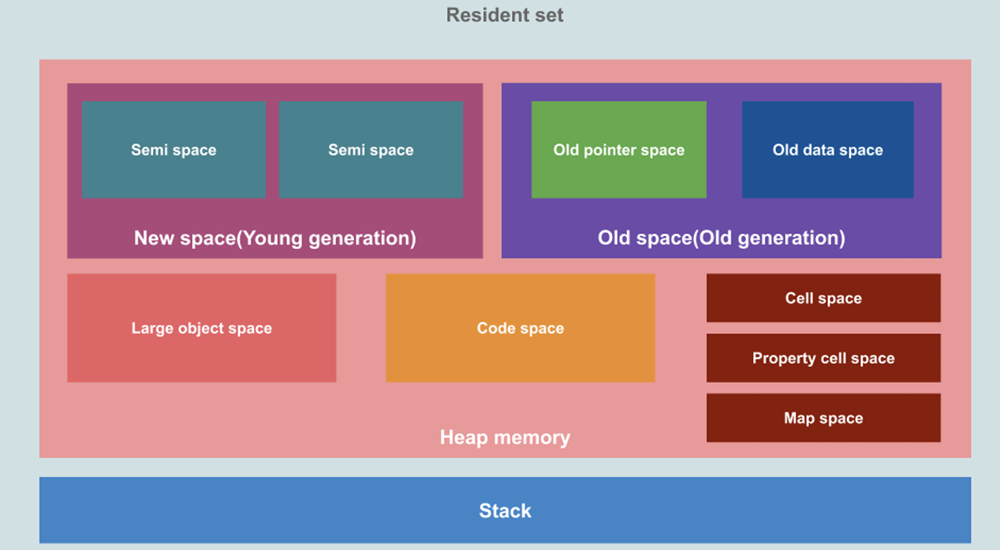

# 内存管理和闭包

## JavaScript 内存管理

### 认识内存管理

- 不管什么样的编程语言，在代码的执行过程中都是需要给它分配内存的，不同的是某些编程语言需要我们自己手动的管理内存，某些编程语言会可以自动帮助我们管理内存：
- 不管以什么样的方式来管理内存，内存的管理都会有如下的生命周期：
  - 第一步：分配申请你需要的内存（申请）；
  - 第二步：使用分配的内存（存放一些东西，比如对象等）；
  - 第三步：不需要使用时，对其进行释放；
- 不同的编程语言对于第一步和第三步会有不同的实现：
  - 手动管理内存：比如 C、C++，包括早期的 OC，都是需要手动来管理内存的申请和释放的（malloc 和 free 函数）；
  - 自动管理内存：比如 Java、JavaScript、Python、Swift、Dart 等，它们有自动帮助我们管理内存；
- 对于开发者来说，JavaScript 的内存管理是自动的、无形的。
  - 我们创建的原始值、对象、函数……这一切都会占用内存；
  - 但是我们并不需要手动来对它们进行管理，JavaScript 引擎会帮助我们处理好它

### JavaScipte 的内存管理

- JavaScript 会在定义数据时为我们分配内存。
- 但是内存分配方式是一样的吗？
  - JS 对于原始数据类型内存的分配会在执行时，直接在栈空间进行分配；
  - JS 对于复杂数据类型内存的分配会在堆内存中开辟一块空间，并且将这块空间的指针返回值变量引用；

### JavaScript 的垃圾回收

- 因为内存的大小是有限的，所以当内存不再需要的时候，我们需要对其进行释放，以便腾出更多的内存空间。
- 在手动管理内存的语言中，我们需要通过一些方式自己来释放不再需要的内存，比如 free 函数：
  - 但是这种管理的方式其实非常的低效，影响我们编写逻辑的代码的效率；
  - 并且这种方式对开发者的要求也很高，并且一不小心就会产生内存泄露；
- 所以大部分现代的编程语言都是有自己的垃圾回收机制：
  - 垃圾回收的英文是 Garbage Collection，简称 GC；
  - 对于那些不再使用的对象，我们都称之为是垃圾，它需要被回收，以释放更多的内存空间；
  - 而我们的语言运行环境，比如 Java 的运行环境 JVM，JavaScript 的运行环境 js 引擎都会内存 垃圾回收器；
  - 垃圾回收器我们也会简称为 GC，所以在很多地方你看到 GC 其实指的是垃圾回收器；
- 但是这里又出现了另外一个很关键的问题：GC 怎么知道哪些对象是不再使用的呢？
  - 这里就要用到 GC 的实现以及对应的算法；

## 常见的 GC 算法

### 引用计数（Reference counting）

- 引用计数：
  - 当一个对象有一个引用指向它时，那么这个对象的引用就+1；
  - 当一个对象的引用为 0 时，这个对象就可以被销毁掉；
- 这个算法有一个很大的弊端就是会产生循环引用；

### 标记清除（mark-Sweep）

- 标记清除：
  - 标记清除的核心思路是可达性（Reachability）
  - 这个算法是设置一个根对象（root object），垃圾回收器会定期从这个根开始，找所有从根开始有引用到的对象，对于哪些没有引用到的对象，就认为是不可用的对象；
- 这个算法可以很好的解决循环引用的问题；

### 其他算法优化补充

- JS 引擎比较广泛的采用的就是可达性中的标记清除算法，当然类似于 V8 引擎为了进行更好的优化，它在算法的实现细节上也会结合一些其他的算法。
- 标记整理（Mark-Compact）和“标记－清除”相似；
  - 不同的是，回收期间同时会将保留的存储对象搬运汇集到连续的内存空间，从而整合空闲空间，避免内存碎片化；
  - 使得存放东西的内存是连续的
- 分代收集（Generational collection）——对象被分成两组：“新的”和“旧的”。
  - 许多对象出现，完成它们的工作并很快死去，它们可以很快被清理；
  - 那些长期存活的对象会变得“老旧”，而且被检查的频次也会减少；
- 增量收集（Incremental collection）
  - 如果有许多对象，并且我们试图一次遍历并标记整个对象集，则可能需要一些时间，并在执行过程中带来明显的延迟。
  - 所以引擎试图将垃圾收集工作分成几部分来做，然后将这几部分会逐一进行处理，这样会有许多微小的延迟而不是一个大的延迟；
- 闲时收集（Idle-time collection）
  - 垃圾收集器只会在 CPU 空闲时尝试运行，以减少可能对代码执行的影响。

